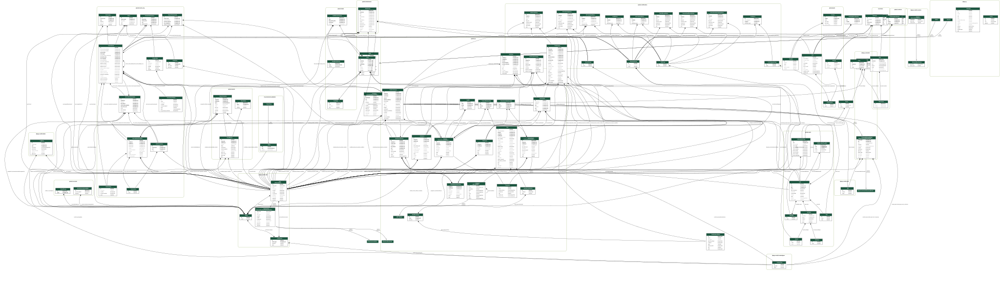

.. _dev_schema:

QATrack+ Database Schema
=========================

Below you will find the most recent database schema diagram generated for
QATrack+ (v4.0.0). Older v3.1.0 and v0.3.0 diagrams are also kept for
reference, further down this page.

   The QATrack+ v4.0.0 schema (click to view full size or right click and view
   in new tab to view full size)

This diagram is regenerated on demand (see *Generating the schema diagram*
below) rather than on every release, so it may lag behind the current
version - regenerate it if you need one that reflects the latest models.

Generating the schema diagram
-----------------------------

Ubuntu
~~~~~~

On Ubuntu (tested on 18.04) you need to install a few dependencies before
generating the schema diagram:

.. code-block:: sh

    sudo apt install python-dev graphviz libgraphviz-dev pkg-config 
    uv pip install pygraphviz         

and then you can generate your schema with:

.. code-block:: sh

    make schema

which will output the schema to docs/developer/images/qatrack_schema_$(VERSION).svg

Windows
~~~~~~~

It is also possible to generate a schema diagram on Windows using Sql Server
Management Studio. See
https://dataedo.com/kb/tools/ssms/create-database-diagram for instructions on
making a diagram with SSMS.

Schema for Older Versions
=========================

.. figure:: images/qatrack_schema_3.1.0.svg
   :alt: QATrack+ v3.1.0 schema

   The QATrack+ v3.1.0 schema (click to view full size or right click and view
   in new tab to view full size)

.. figure:: images/qatrack_schema_0.3.0.svg
   :alt: QATrack+ v0.3.0 schema

   The QATrack+ v0.3.0 schema (click to view full size or right click and view
   in new tab to view full size)

Database diagrams for even older versions of QATrack+ are available on
BitBucket: `Schema diagrams
<https://bitbucket.org/tohccmedphys/qatrackplus/wiki/v/0.2.9/developers/schema.md>`__.
