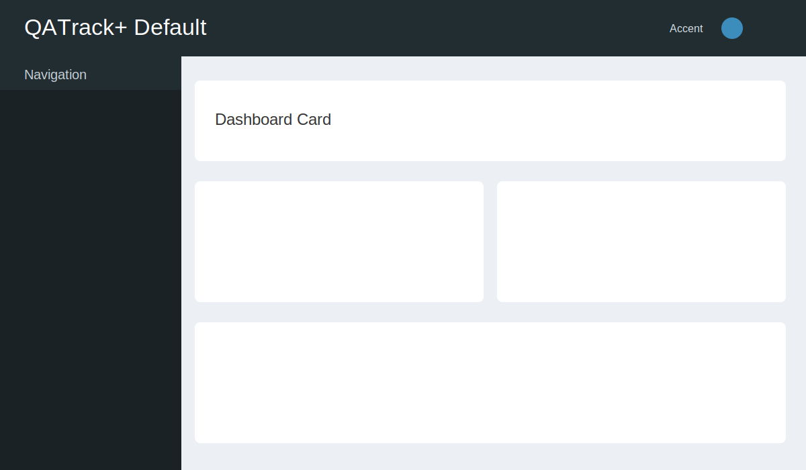
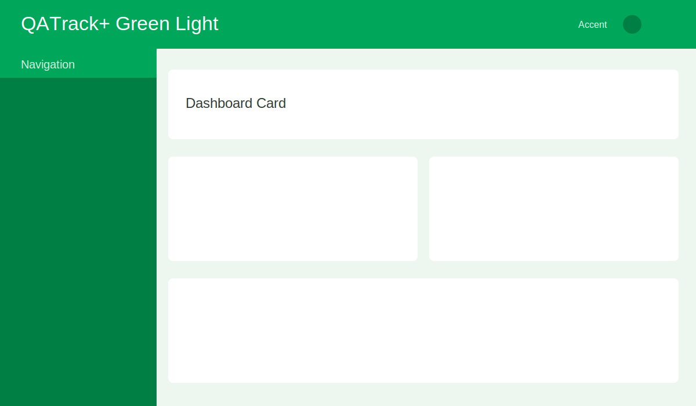
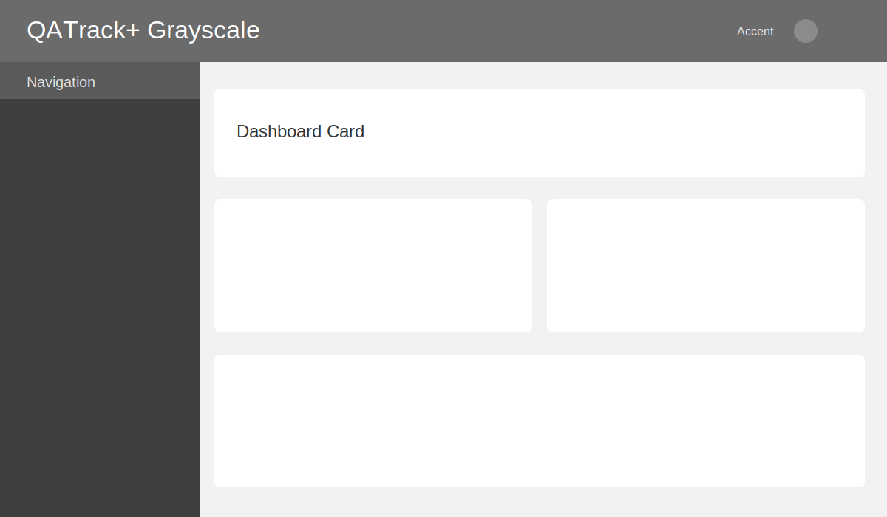

============================
Changing the Site Color Skin
============================

QATrack+ now supports choosing an AdminLTE skin with the ``SITE_SKIN``
setting. This lets an administrator switch the overall color palette without
editing CSS files.

Where to set it
---------------

Set ``SITE_SKIN`` in your deployment's ``local_settings.py`` file.

Example:

.. code-block:: python

    # local_settings.py
   SITE_SKIN = "skin-green-light"

If ``SITE_SKIN`` is missing or invalid, QATrack+ falls back to
``skin-black-dark``.

Available values
----------------

Use one of the built-in AdminLTE skin names:

- ``skin-black``
- ``skin-black-dark`` (default)
- ``skin-black-light``
- ``skin-blue``
- ``skin-blue-light``
- ``skin-green``
- ``skin-green-light``
- ``skin-purple``
- ``skin-purple-light``
- ``skin-red``
- ``skin-red-light``
- ``skin-yellow``
- ``skin-yellow-light``

Recommended preset and examples
-------------------------------

For a generic, inviting look for non-technical users, use:

.. code-block:: python

   SITE_SKIN = "skin-green-light"

Other common presets:

Default:

.. code-block:: python

   SITE_SKIN = "skin-black-dark"

Neutral grayscale:

.. code-block:: python

   SITE_SKIN = "skin-black-light"

Apply the change
----------------

After updating ``SITE_SKIN``:

1. Restart your QATrack+ web process (Apache/mod_wsgi or your current host).
2. Refresh the browser.
3. If needed, clear cached static files in your browser.

Palette previews
----------------

Default (``skin-black-dark``):

Recommended Green (``skin-green-light``):

Grayscale (``skin-black-light``):

Notes
-----

- These are representative previews for quick comparison.
- Exact appearance may differ slightly depending on your custom CSS overrides.
